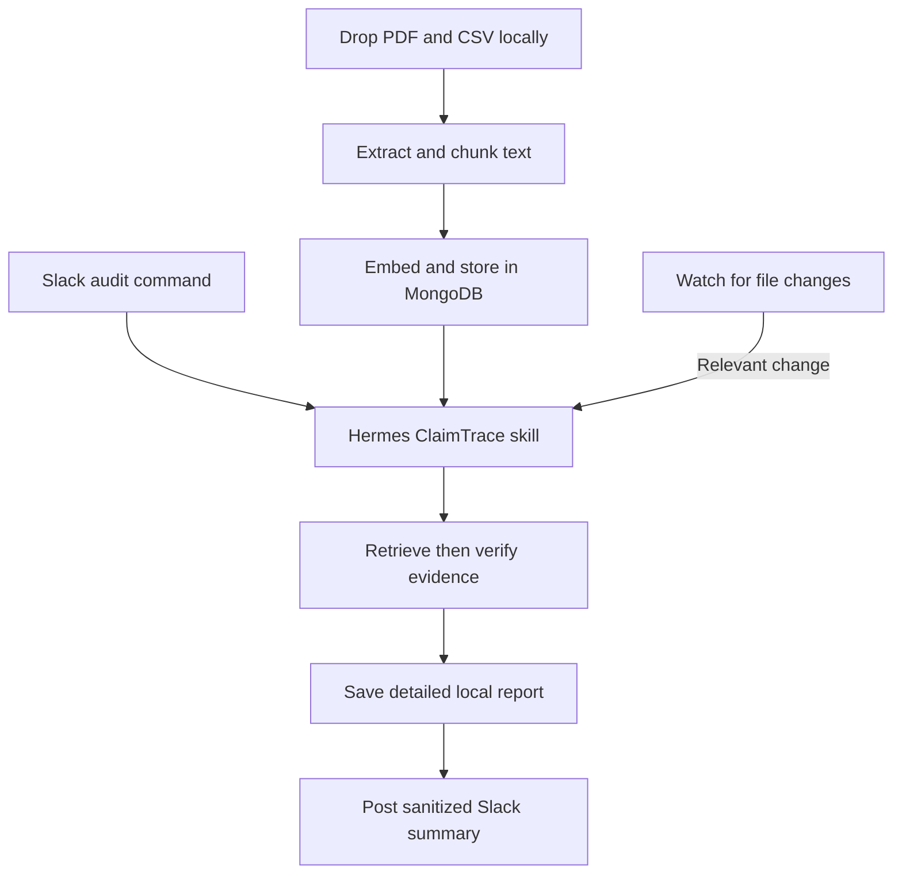
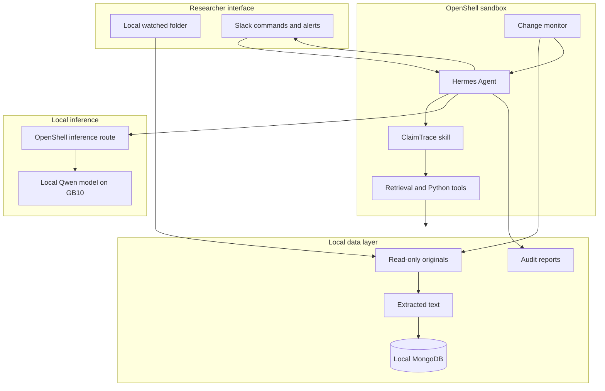
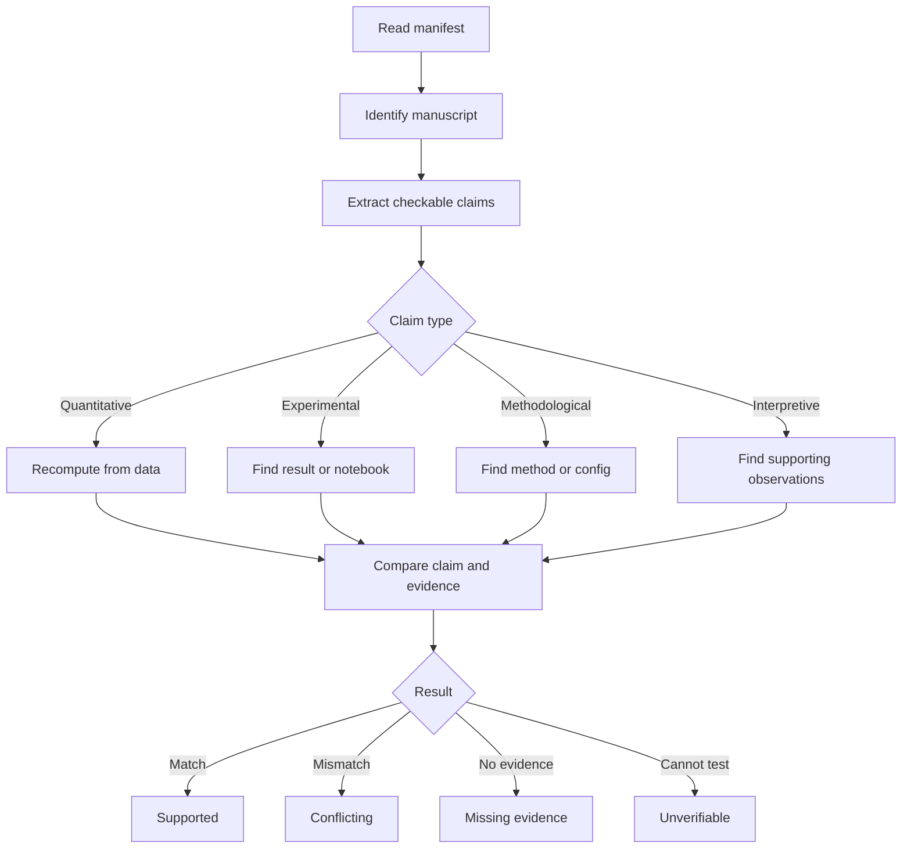

# ClaimTrace: Local Research Integrity Agent

## 1. Executive Summary

ClaimTrace is an always-on, local-first research integrity agent for researchers working with unpublished or proprietary material. It audits claims in a manuscript against the project's underlying evidence—experimental results, spreadsheets, notebooks, code, protocols, and notes—without sending that intellectual property to a cloud model.

The hackathon MVP uses a small local retrieval pipeline backed by MongoDB. Research files enter through a watched folder on the GB10, text and embeddings are generated locally, and Hermes uses retrieval only to find evidence candidates. It then verifies claims against the original files with deterministic Python tools. Slack replaces a custom Streamlit frontend: it carries project IDs, commands, and sanitized notifications, while manuscripts, evidence, and detailed reports remain local.

### One-line pitch

> ClaimTrace is a private, local research agent that verifies unpublished claims against the underlying evidence and automatically rechecks them whenever the research changes.

### Why local execution matters

- Pre-publication manuscripts and experimental results may contain valuable intellectual property.
- Institutional policies or collaboration agreements may prohibit sending unpublished data to third-party APIs.
- Research artifacts can be large, heterogeneous, and difficult to trace manually.
- Local execution provides a compelling reason to use the Dell GB10 instead of treating privacy as a superficial feature.

## 2. Problem Statement

Before submission, researchers must answer questions such as:

- Which experiment supports each major claim?
- Does the number in the paper match the latest result file?
- Was a figure regenerated after the evaluation code changed?
- Are claims based on an outdated experiment or configuration?
- Are any strong conclusions missing direct evidence?

This work is typically performed manually across PDFs, Word documents, CSV files, notebooks, source code, and lab notes. That makes the process slow and prone to stale results, transcription mistakes, and missing evidence.

## 3. Product Goals

The MVP must:

1. Run entirely on the event's Dell GB10.
2. Run Hermes Agent through NemoClaw; OpenShell remains the underlying sandbox and policy runtime.
3. Use only local model inference through the NemoClaw-managed inference route.
4. Accept a native-text PDF manuscript and CSV evidence through a local watched folder.
5. Extract important, checkable claims from the primary manuscript.
6. Trace each claim to specific evidence files and locations.
7. Recompute simple quantitative claims when sufficient data is available.
8. Classify claims as supported, conflicting, missing evidence, or unverifiable.
9. Cite exact local file paths and calculations in the output.
10. Automatically re-audit affected claims when source files change.

## 4. Non-Goals for the Hackathon

- Building a production-scale or multi-tenant RAG platform.
- Reliably reproducing arbitrary scientific software environments.
- Judging whether a scientific conclusion is universally true.
- Replacing peer review, statistical review, or research ethics review.
- Searching the public internet or external paper databases.
- Supporting hundreds of thousands of documents in the MVP.
- Uploading confidential documents, excerpts, or full reports through Slack.

## 5. Target Users and Core User Stories

### Primary user

A researcher or research team preparing a manuscript that contains confidential, proprietary, or pre-publication information.

### Core user stories

- As a researcher, I can add my manuscript and evidence files through a local project folder without uploading them to Slack or another cloud service.
- As a researcher, I can ask which evidence supports a specific claim.
- As a researcher, I can request an audit of all major quantitative claims.
- As a researcher, I can see the exact files and calculations used by the agent.
- As a researcher, I am warned when a reported value differs from the source data.
- As a researcher, I receive a sanitized Slack notification when a changed result file invalidates an earlier audit.

## 6. MVP Experience



### Example request

> @ClaimTrace audit project project-123

### Required output

| Claim | Manuscript location | Evidence | Verification | Status |
|---|---|---|---|---|
| Accuracy improved by 12% | Results, page 7 | `results.csv` | Computed 10.8% | Conflict |
| Evaluated on five datasets | Methods, page 4 | `config.yaml` | Five datasets found | Supported |
| More robust to noise | Discussion, page 9 | No direct artifact found | Not computable | Missing evidence |

## 7. System Architecture



### Component responsibilities

- **NemoClaw:** installs and manages the Hermes sandbox and connects it to local inference.
- **OpenShell:** enforces sandbox isolation, filesystem policy, network policy, and the inference route.
- **Hermes Agent:** runs the ClaimTrace workflow, loads skills, receives Slack commands, and invokes tools.
- **Local model:** performs planning, claim extraction, evidence reasoning, and report synthesis.
- **Slack:** provides commands and sanitized completion alerts; it never receives confidential source files or detailed evidence.
- **Local watched folder:** is the private ingestion interface for manuscripts and evidence.
- **MongoDB:** stores document chunks, embeddings, file metadata, claims, evidence links, and audit history.
- **Ingestion service:** extracts text, hashes files, and maintains the manifest.
- **Change monitor:** detects modified artifacts and triggers a targeted re-audit.

## 8. Technology Stack

| Layer | Technology | Responsibility |
|---|---|---|
| Hardware | Dell Pro Max with GB10 | Local ARM64 CPU/GPU compute |
| Agent installation and lifecycle | NVIDIA NemoClaw | Setup, model routing, sandbox lifecycle |
| Agent runtime | Hermes Agent | Planning, tools, skills, and Slack messaging |
| Security runtime | NVIDIA OpenShell | Filesystem, process, and network boundaries |
| Model serving | NemoClaw-managed local vLLM | Local inference on the GB10 |
| Model | Event-provided Qwen 3.6 35B A3B NVFP4 profile | Reasoning and tool selection |
| User interface | Slack + local watched folder | Commands/alerts plus private file ingestion |
| Application language | Python 3.11+ | Ingestion, verification, reporting |
| PDFs | PyMuPDF | Native PDF text and page extraction |
| CSV evidence | `pandas` | Table inspection and calculations |
| Embeddings | Local sentence-transformers model | On-device vector generation |
| Database | Local MongoDB | Documents, vectors, claims, evidence, audit state |
| Vector retrieval | MongoDB Vector Search, with Python cosine fallback | Semantic evidence discovery |
| Code and text search | `ripgrep` and Python | Exact project-wide search |
| Reports | Markdown and Jinja2 | Human-readable audit output |
| Automation | `watchdog` or hash polling | Automatic re-audits when evidence changes |

## 9. Retrieval and Verification Strategy

MongoDB retrieval helps Hermes find likely evidence, but retrieval is not treated as verification:

1. Extract PDFs and documents into readable text.
2. Chunk text by page or section and generate embeddings locally.
3. Store chunks, vectors, paths, pages, hashes, and project IDs in MongoDB.
4. Generate a local embedding for the audit query or extracted claim.
5. Retrieve the most relevant chunks with MongoDB Vector Search.
6. Open the original files associated with those chunks.
7. Use Python and pandas to verify numerical evidence.
8. Cite the original file path, page, and calculation.

CSV files should be parsed directly rather than embedded as arbitrary text. MongoDB stores their metadata and relationship to claims, while pandas performs deterministic calculations.

If native MongoDB Vector Search cannot be configured quickly on the GB10, the MVP will still store embeddings in MongoDB and calculate cosine similarity in Python. This preserves the data model and demo workflow while avoiding an infrastructure blocker.

## 10. Project Data Layout

```text
claimtrace/
├── claimtrace/
│   ├── ingest.py
│   ├── extract_pdf.py
│   ├── embeddings.py
│   ├── mongodb.py
│   ├── retrieval.py
│   ├── manifest.py
│   ├── verifier.py
│   ├── watcher.py
│   └── report.py
├── slack/
│   └── message-contract.md
├── skills/
│   └── claimtrace/
│       ├── SKILL.md
│       └── references/
│           ├── output-schema.md
│           └── verification-rules.md
├── projects/
│   └── project-id/
│       ├── originals/
│       ├── extracted/
│       ├── manifest.json
│       ├── audit-state.json
│       └── reports/
├── demo-data/
├── tests/
└── requirements.txt
```

The agent should receive read-only access to `originals/` and write access only to `extracted/` and `reports/`. MongoDB stores the manifest, embeddings, claim records, and audit state.

## 11. File Ingestion Flow

For each file added to the local watched folder:

1. Validate the extension and file size.
2. Generate a stable project-relative path.
3. Save the unmodified original.
4. Compute a SHA-256 hash.
5. Detect the artifact type.
6. Extract a searchable representation where appropriate.
7. Record extraction warnings.
8. Upsert the document record and chunks in MongoDB.
9. Make the project visible inside the OpenShell sandbox through the approved workspace mount or upload mechanism.
10. Trigger an initial or incremental audit.

Example MongoDB document record:

```json
{
  "project_id": "project-123",
  "path": "originals/results.csv",
  "sha256": "sha256-value",
  "artifact_type": "experimental_data",
  "mime_type": "text/csv",
  "modified_at": "2026-09-12T14:00:00Z",
  "extraction_status": "not_required"
}
```

Example MongoDB chunk record:

```json
{
  "project_id": "project-123",
  "document_id": "manuscript-001",
  "path": "originals/manuscript.pdf",
  "page": 7,
  "section": "Results",
  "text": "Our method improves accuracy by 12 percent.",
  "embedding": [0.021, -0.183, 0.074]
}
```

The embedding array is generated by a local model. The vector-search index must use that model's exact output dimension and cosine similarity. Embeddings are treated as sensitive research data and remain in the local database.

## 12. Agent Skills

### 12.1 ClaimTrace coordinator skill

The custom `claimtrace` skill is the central behavioral specification. It tells Hermes to:

- Identify the primary manuscript.
- Extract only meaningful and checkable claims.
- Prioritize quantitative, comparative, methodological, and reproducibility claims.
- Search the project before concluding evidence is absent.
- Distinguish direct evidence from circumstantial evidence.
- Use deterministic tools for calculations.
- Preserve originals and never silently edit source material.
- Cite exact project-relative paths and manuscript locations.
- State uncertainty instead of inventing evidence.
- Return results using the defined schema.

### 12.2 Document extraction skill

Responsibilities:

- Extract native PDF text with page boundaries.
- Flag scanned PDFs for the optional local OCR fallback.
- Record failed or partially extracted documents.

### 12.3 Evidence verification skill

Responsibilities:

- Match manuscript claims to candidate artifacts.
- Prefer raw results over summaries when both exist.
- Check whether experiment names, datasets, and configurations align.
- Recompute simple statistics with Python.
- Record both the reported and computed values.
- Never claim successful reproduction when dependencies or raw data are missing.

### 12.4 Incremental audit skill

Responsibilities:

- Compare current hashes with the previous manifest.
- Map changed files to previously supported claims.
- Re-audit only affected claims when possible.
- Notify the user if a previously supported claim becomes conflicting or unsupported.

### 12.5 Slack interaction skill

Responsibilities:

- Accept commands containing only an action and local project ID.
- Never request that users attach confidential research files in Slack.
- Return audit counts and severity summaries without quoting manuscript content.
- Direct the researcher to the local report for evidence details.
- Avoid sending generated reports as Slack attachments.

### 12.6 Report generation skill

Responsibilities:

- Produce an executive summary.
- Create the claim-to-evidence matrix.
- Group warnings by severity.
- List calculations and files inspected.
- List ignored or unreadable files.
- Recommend concrete next actions without modifying the manuscript.

For hackathon speed, these behaviors may initially live in one `SKILL.md` with helper scripts. They can be split after the end-to-end workflow works.

## 13. Claim Audit Workflow



### Structured claim record

```json
{
  "claim_id": "claim-003",
  "claim": "Our method improves accuracy by 12%.",
  "manuscript_location": "Results, page 7",
  "claim_type": "quantitative",
  "evidence_files": [
    "originals/results.csv",
    "originals/evaluation.ipynb"
  ],
  "reported_value": 12.0,
  "computed_value": 10.8,
  "status": "conflicting",
  "confidence": "high",
  "explanation": "The local evaluation results show a 10.8% improvement.",
  "recommended_action": "Update the manuscript or verify the evaluation subset."
}
```

## 14. Always-On Behavior

The autonomous behavior is a core feature, not a stretch goal.

### Trigger

The watcher periodically hashes project files or listens for filesystem changes. A changed, added, or removed artifact creates an audit event.

### Agent action

1. Determine which claims previously cited the changed artifact.
2. Re-run the relevant extraction or verification step.
3. Update the evidence matrix.
4. Record what changed and why.
5. Save the detailed result locally and send a sanitized Slack notification.

### Best demo moment

Start with a claim marked **Supported**. Replace the associated CSV with an updated result containing a different metric. Without another chat prompt, ClaimTrace detects the change, re-runs the calculation, and changes the claim to **Conflict**.

## 15. Privacy and Security Design

- Use only the local vLLM model selected by NemoClaw.
- Do not configure cloud LLM providers or web search.
- Allow only the Slack endpoints required for commands and sanitized notifications.
- Never upload source files to Slack or include claims, excerpts, measurements, embeddings, or full reports in Slack messages.
- Bind dashboards and application ports to `127.0.0.1`.
- Deny all other outbound network access through OpenShell policy.
- Expose only the designated project workspace to the agent.
- Keep source artifacts read-only.
- Keep secrets and NemoClaw state out of the public repository.
- Avoid logging document contents; log file IDs, hashes, actions, and status.
- Include a local project deletion workflow.
- Include the active model, inference route, and allowed network destinations in the local audit log.

Local-first is a configuration that must be verified. Slack is a cloud control plane, so the product must claim that **research files and model inference remain local**, not that the system makes zero network requests.

## 16. Implementation Plan

### Phase 0: Environment verification — P0

- Confirm ARM64, GPU, disk, Docker, NemoClaw, and OpenShell status.
- Confirm the local vLLM endpoint and loaded model.
- Confirm Hermes can complete one tool-using turn.
- Verify network policy and project workspace access.

**Exit criterion:** Hermes reads a local text file and responds using local inference.

### Phase 1: Vertical slice — P0

- Create one synthetic native-text PDF manuscript and CSV.
- Manually place them in one project folder.
- Implement the first ClaimTrace skill prompt.
- Return three claim records: supported, conflicting, and missing evidence.

**Exit criterion:** One end-to-end audit works before Slack integration or presentation polish.

### Phase 2: Ingestion — P0

- Implement the local watched-folder convention.
- Add native PDF and CSV readers.
- Generate hashes, text chunks, and local embeddings.
- Store documents, chunks, vectors, and audit state in MongoDB.
- Preserve page and source locations in extracted text.

**Exit criterion:** The agent can reliably discover and read every demo artifact.

### Phase 3: Verification — P0

- Implement deterministic pandas calculations.
- Add reported-versus-computed comparisons.
- Capture tool inputs and calculation descriptions.
- Enforce the structured claim schema.

**Exit criterion:** The numerical discrepancy in the demo dataset is consistently detected.

### Phase 4: Always-on monitor — P0

- Detect added, changed, and removed files.
- Save the prior audit state.
- Map changed artifacts to affected claims.
- Trigger a local incremental audit and notification.

**Exit criterion:** Updating the demo CSV changes the audit without a new user prompt.

### Phase 5: Slack and report — P1

- Connect the Hermes Slack channel.
- Accept commands containing an action and project ID.
- Return progress and severity counts without sensitive content.
- Export the detailed evidence matrix as a local Markdown report.

**Exit criterion:** A Slack command triggers the audit, while sensitive details appear only in the local report.

### Phase 6: Hardening and pitch — P1

- Test clean startup and restart.
- Test malformed and unsupported files.
- Freeze the demo dataset.
- Record a backup demo video.
- Prepare architecture and impact slides.

### Stretch goals — P2

- Local OCR for scanned PDFs.
- Native MongoDB Vector Search if the MVP uses the Python cosine fallback.
- Restricted notebook execution.
- Comparison between manuscript versions.
- Figure and table consistency checks.
- Multi-user or multi-project support.

## 17. Suggested Team Split

| Owner | Responsibilities |
|---|---|
| Agent/runtime | NemoClaw, Hermes skill, OpenShell policy, Slack channel, local inference |
| Data/verification | PDF ingestion, embeddings, MongoDB retrieval, pandas verification, watcher |
| Product/demo | Slack interaction, local report, demo dataset, pitch |

For a two-person team, combine data/verification with Slack and reporting. For a four-person team, assign a dedicated evaluation and demo owner.

## 18. Evaluation Plan

Create a synthetic but realistic research package containing:

- A manuscript with six checkable claims.
- A results CSV supporting two claims.
- A second section of the PDF supporting a methods claim.
- One deliberately mismatched reported value.
- One deliberately unsupported interpretive claim.
- A second version of the CSV that invalidates a previously supported claim.

### Metrics

| Metric | MVP target |
|---|---:|
| Major claims extracted | At least 5 of 6 |
| Supported claims correctly classified | 100% in demo set |
| Injected discrepancies detected | 100% in demo set |
| Evidence citations with valid paths | 100% |
| False claims of verification | 0 |
| Cloud LLM calls | 0 |
| Sensitive content sent to Slack | 0 |
| Incremental re-audit | Completes during live demo |

## 19. Risks and Mitigations

| Risk | Impact | Mitigation |
|---|---|---|
| Model or image download takes too long | Blocks development | Check provisioned state first; use organizer cache and preserve a known-good sandbox |
| PDF extraction fails | Manuscript cannot be audited | Use a native-text demo PDF and keep OCR as fallback |
| Model invents evidence | Damages trust | Require valid paths, tool output, status enums, and explicit uncertainty |
| Generic agent searches too broadly | Slow or incomplete audit | Provide a manifest, bounded workflow, and claim limits |
| MongoDB Vector Search setup blocks progress | Delays core functionality | Store vectors in MongoDB and calculate cosine similarity in Python |
| Slack leaks research content | Invalidates privacy claim | Send only project IDs, counts, statuses, and local report pointers |
| Autonomous trigger is unreliable | Loses judging value | Use simple polling and hashes rather than a complex event system |
| Private data appears in logs | Weakens privacy story | Log metadata and actions, not extracted content |

## 20. Definition of Done

The MVP is complete when the team can:

1. Block general internet access while allowing only the configured Slack channel endpoints.
2. Launch ClaimTrace on the GB10.
3. Place a native-text PDF manuscript and CSV in the local watched folder.
4. Audit at least three claims.
5. Show one supported claim, one inconsistent number, and one unsupported claim.
6. Show the exact files and calculations used.
7. Modify an evidence file and demonstrate an automatic targeted re-audit.
8. Export a local report.
9. Confirm that all inference, research files, embeddings, claims, and detailed reports remained local.

## 21. Three-Minute Demo Outline

### 0:00–0:30 — Problem

Explain that unpublished manuscripts and results are highly sensitive, but researchers still perform manual claim-to-evidence checks across fragmented files.

### 0:30–1:00 — Local architecture

Show the GB10, local model status, Hermes sandbox, and restricted network policy.

### 1:00–2:00 — Audit

Place the synthetic project in the local folder and trigger the audit from Slack. Show the local evidence matrix, exact file citations, and recomputed discrepancy.

### 2:00–2:35 — Autonomous behavior

Replace the result CSV. Show ClaimTrace detect the change and automatically downgrade the affected claim from Supported to Conflict.

### 2:35–3:00 — Value

Close with the time saved, reduced submission risk, defensible provenance, and the fact that pre-publication IP never leaves the researcher's machine.

## 22. Immediate Next Actions

1. Verify the provisioned NemoClaw/Hermes environment.
2. Commit a synthetic demo research package.
3. Start local MongoDB and verify document inserts.
4. Implement PDF extraction, local embeddings, and retrieval.
5. Implement the smallest end-to-end ClaimTrace skill.
6. Make one discrepancy detection deterministic.
7. Add the automatic file-change trigger.
8. Connect Slack only after the vertical slice works.
