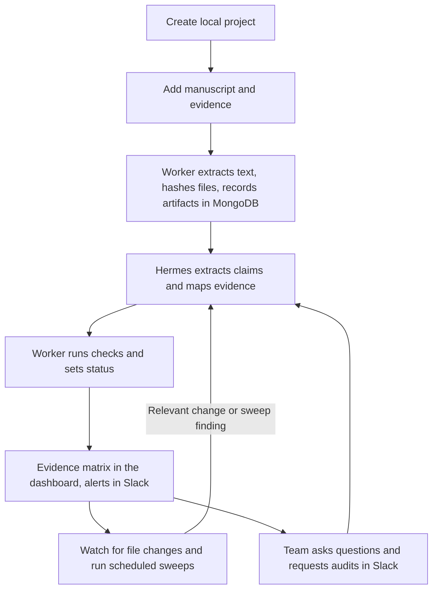
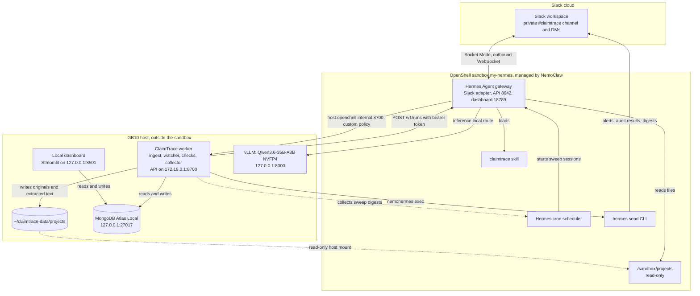
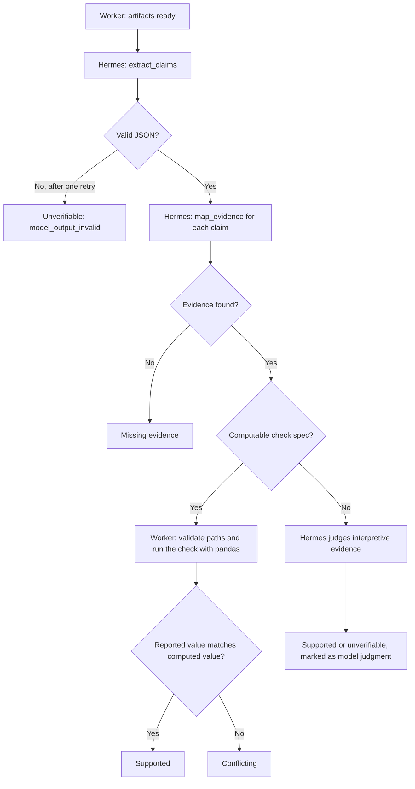

# ClaimTrace: Local Research Integrity Agent

> **Revision 3, 2026-09-12 (afternoon ET).** This revision reworks the original plan to match this morning's rule changes and the stack now running on the GB10:
> - **Hermes Agent** runs in an **OpenShell** sandbox managed by **NemoClaw**.
> - **MongoDB** is the system of record.
> - A host worker handles files and calculations; the sandboxed agent handles the steps that need a model.
> - **Slack** is the team front-end.
> - The agent runs a scheduled sweep.
> - New guidelines cover working with the local model.
>
> **Still open (team decisions):** MVP scope and the cut list (§20), and the business model details (§3).

## 1. Executive Summary

ClaimTrace is an always-on, local-first research integrity agent for researchers working with unpublished or proprietary material. It audits claims in a manuscript against the project's underlying evidence: experimental results, spreadsheets, notebooks, code, configuration, and notes. None of that intellectual property is sent to a cloud model.

It runs on a Dell Pro Max with GB10:
- **Hermes Agent** works inside an NVIDIA OpenShell sandbox managed by NemoClaw, using a locally served Qwen3.6 model.
- **A host worker** handles files, deterministic calculations, and MongoDB.
- **Slack:** teams ask ClaimTrace questions, request audits, and receive alerts and digests.
- **Local dashboard:** shows the full evidence matrix and handles file uploads.
- **Delivery:** ClaimTrace is sold as a managed service. The vendor rents out the hardware and keeps the local models and agent workflows supported (§3).

The MVP deliberately avoids a RAG pipeline. For a bounded project folder, the agent reads extracted text and source files directly through a read-only mount, and code does every calculation.

### One-line pitch

> ClaimTrace is a private, local research agent that verifies unpublished claims against the underlying evidence and automatically rechecks them whenever the research changes.

### Why local execution matters

- Pre-publication manuscripts and experimental results may contain valuable intellectual property.
- Institutional policies or collaboration agreements may prohibit sending unpublished data to third-party APIs.
- Research artifacts can be large, varied in format, and difficult to trace manually.
- Local execution gives a real reason to use the Dell GB10; privacy is not a superficial feature.

## 2. Rules and Stack Decisions

| Topic | Decision | Source and status |
|---|---|---|
| Required tools | At least **one** of NemoClaw, OpenClaw, or OpenShell. We use **NemoClaw + OpenShell**, with **Hermes Agent** as the agent. | Event intro slides, Sep 12. The organizer emails and public event page still say all three are required. **Confirm on Discord in writing.** |
| Database | **MongoDB is required.** We run MongoDB Atlas Local on the GB10. | Intro slides. They didn't say whether a local instance counts or it must be Atlas cloud. Confirm on Discord. |
| Inference | Local only: `nvidia/Qwen3.6-35B-A3B-NVFP4` on NemoClaw-managed vLLM. The product makes no cloud LLM calls. | Hackathon rule. |
| Front-end | **Slack** for the team, plus a local dashboard. Slack is cloud messaging, not an LLM call (§16.6). | Team decision. |
| Pre-built agents | Hermes is the agent framework; the organizers pointed teams to it. The ClaimTrace skill, worker, checks, Slack flows, and schedules are written today. | Hackathon rule. |

### Current environment (verified 1:15–1:45 PM ET)

- **Stack versions:** NemoClaw v0.0.123 and OpenShell 0.0.106 (Docker driver).
- **Sandbox:** `my-hermes`, phase Ready, running Hermes Agent v0.20.6. The CLI is `nemohermes`, in `~/.nvm/versions/node/v22.23.2/bin`.
- **Inference:** provider `vllm-local`, served by container `nemoclaw-vllm` on `127.0.0.1:8000`. The sandbox reaches it through OpenShell's `inference.local` route.
- **Hermes API:** forwarded to the host at `http://127.0.0.1:8642/v1`. Model id `hermes-agent`; get the bearer token with `nemohermes my-hermes gateway-token --quiet`.
  - `GET /v1/capabilities` reports support for chat completions, the Responses API, runs (submit, status, event stream, stop), sessions, and the skills API.
  - The API has **no cron or jobs admin**. Manage cron jobs with `hermes cron` inside the sandbox.
- **Hermes dashboard:** `http://127.0.0.1:18789/`.
- **Network policy:** Balanced tier, with presets brew, huggingface, local-inference, npm, and pypi applied.
- **Sandbox contents:** `python3` (`/opt/hermes/.venv/bin/python3`) and `/usr/bin/curl`, but **no pandas**. `/opt/hermes` is read-only.
- **Reaching the host:** inside the sandbox, `host.openshell.internal` resolves to `172.18.0.1`, the Docker bridge address on the host.
- **Hermes can post to Slack without the model:** `hermes send --to slack:<channel_id>` works once Slack is configured.
- **Not configured yet:** the host mount and Slack (§12.3).
- **MongoDB:** container `hackathon-mongodb` (Atlas Local 8.0.28) on `127.0.0.1:27017`. It's a single-node replica set, so change streams work. Credentials are in `~/.config/hackathon/mongodb.env`; never commit them.
- **Don't use the host Hermes install in `~/.hermes`.** It's a teammate's install configured for the Nous Portal cloud model, and it is not part of the product.

## 3. Business Model (draft, team finalizing)

Current direction: ClaimTrace is the flagship workflow of a vendor that sells **local research agents as a managed service** to researchers. The package includes:

- **Hardware on a rental basis:** GB10-class workstations placed with the customer, so manuscripts and data never leave the institution.
- **Ongoing model support:** model updates, serving configuration, and tuning of the local agentic workflows as models and research needs change.
- **Everything else needed to run a local research agent smoothly:** installation, sandbox and security policy, the Slack integration, agent skills such as ClaimTrace, and maintenance.

Open questions for the team:

- Which customers to target first.
- The pricing unit, for example per box per month, per seat, or per project.
- The impact number to quote in the pitch. MongoDB's `audit_runs`, `audit_events`, and `notifications` collections can report claims checked, discrepancies caught, time per audit, and alerts sent from real runs.

Judging reminder: business value is 30% of the score, described as "a real corporate workflow with measurable impact, something a company would actually pay for."

## 4. Problem Statement

Before submission, researchers must answer questions such as:

- Which experiment supports each major claim?
- Does the number in the paper match the latest result file?
- Was a figure regenerated after the evaluation code changed?
- Are claims based on an outdated experiment or configuration?
- Are any strong conclusions missing direct evidence?

Researchers usually do this by hand across PDFs, Word documents, CSV files, notebooks, source code, and lab notes. That makes it slow and prone to stale results, transcription mistakes, and missing evidence.

## 5. Product Goals

The MVP must:

1. Run entirely on the event's Dell GB10.
2. Run the agent as Hermes inside an OpenShell sandbox managed by NemoClaw.
3. Use only local model inference through the NemoClaw-managed vLLM route.
4. Store project, artifact, claim, audit, and notification state in MongoDB.
5. Accept a research project containing multiple file types.
6. Extract important, checkable claims from the primary manuscript.
7. Trace each claim to specific evidence files and locations.
8. Recompute quantitative claims with deterministic code when enough data is available.
9. Classify claims as supported, conflicting, missing evidence, or unverifiable.
10. Cite exact project-relative file paths and calculations in the output.
11. Automatically re-audit affected claims when source files change.
12. Run a scheduled sweep without prompting and record its results.
13. Let the team use ClaimTrace from Slack: questions, audit requests, alerts, and digests.

## 6. Non-Goals for the Hackathon

- Building a general-purpose vector database or production RAG platform.
- Reliably reproducing arbitrary scientific software environments.
- Judging whether a scientific conclusion is universally true.
- Replacing peer review, statistical review, or research ethics review.
- Searching the public internet or external paper databases.
- Supporting hundreds of thousands of documents in the MVP.

## 7. Target Users and Core User Stories

### Primary user

A researcher or research team preparing a manuscript that contains confidential, proprietary, or pre-publication information. The customer is the research organization that rents the hardware and support package (§3).

### Core user stories

- As a researcher, I can add my manuscript and evidence files without uploading them to a cloud service.
- As a researcher, I can ask ClaimTrace in Slack which evidence supports a specific claim and get an answer with file paths.
- As a researcher, I can request an audit of all major quantitative claims from Slack or the dashboard.
- As a researcher, I can see the exact files and calculations used by the agent.
- As a researcher, I am warned when a reported value differs from the source data.
- As a research team, we get a Slack alert when a changed result file invalidates an earlier audit.
- As a research lead, I get a digest in Slack of what changed and what needs attention since the last sweep, without asking.

## 8. MVP Experience



### Example requests (in Slack)

> @ClaimTrace audit demo-001. For every major quantitative claim, identify the supporting experiment, verify the reported value, and flag anything unsupported or inconsistent.

> @ClaimTrace why is claim-003 conflicting?

### Required output

| Claim | Manuscript location | Evidence | Verification | Status |
|---|---|---|---|---|
| Accuracy improved by 12% | Results, page 7 | `results.csv` | Computed 10.8% | Conflicting |
| Evaluated on five datasets | Methods, page 4 | `config.yaml` | Five datasets found | Supported |
| More robust to noise | Discussion, page 9 | No direct artifact found | Not computable | Missing evidence |

## 9. System Architecture



### Why the work is split this way

- **Database access stays on the host.** The sandbox never connects to MongoDB and never holds its credentials. The agent proposes results, and the worker decides what gets stored.
- **The agent can read evidence but can't change it.** NemoClaw host mounts are read-only, so OpenShell enforces this, not the prompt.
- **Calculations run on the host.** The sandbox has no pandas, and installing packages at runtime would need internet access to PyPI.
- **Code computes numbers and assigns status.** The model is the least reliable part of the system for arithmetic and strict formatting (§18).
- **Hermes can't start a Slack message on its own.** In Hermes 0.20.6, the `send_message` tool is deliberately not available to the agent. Outbound messages come from replies to people, cron delivery, or the `hermes send` CLI. The worker therefore sends alerts with `hermes send`, which uses the sandbox's Slack credentials; the Slack tokens never sit on the host.
- **Slack requests reach the worker through one narrow door.** For Slack-triggered actions, Hermes calls a small worker API on the host through a custom OpenShell policy that allows only that endpoint (§16.4).

### Component responsibilities

- **NemoClaw (`nemohermes`):** installs and manages the stack. That covers the sandbox lifecycle, local vLLM, the inference route, policy presets, the host mount, the Slack channel and its credentials, port forwards, skill installs, and logs.
- **OpenShell:** isolates the sandbox. It enforces the filesystem policy (read-only mount and system paths), network policy (including the Slack and worker-API endpoints), and process limits, routes inference, and swaps credential placeholders for real Slack tokens at the network boundary.
- **Hermes Agent:**
  - Runs the Slack adapter: answers DMs and @mentions from allowlisted users.
  - Runs the `claimtrace` skill: reads the manuscript and evidence with its file tools and returns claim and evidence-mapping JSON.
  - Writes explanations and digests, and runs the scheduled sweep through its cron scheduler.
- **Local model (Qwen3.6-35B-A3B NVFP4):** extracts claims, plans the evidence search, proposes evidence mappings, and writes the narrative text and Slack answers.
- **ClaimTrace worker (host, Python):**
  - handles ingestion, text extraction, and hashing
  - watches for file changes and runs the audit queue
  - calls the Hermes API and runs deterministic checks
  - assigns status and writes to MongoDB
  - collects sweep output, posts Slack alerts, and exports reports
  - serves the small API that Hermes calls for status lookups and audit requests
- **MongoDB:** the system of record for projects, artifacts, claims, audit runs, status-change events, digests, audit requests, and sent notifications.
- **Slack:** where the team works with ClaimTrace day to day: questions, audit requests, alerts, and digests.
- **Local dashboard (Streamlit):**
  - project creation, file upload, and audit controls
  - progress, the full evidence matrix, the event timeline, and the digest view
  - a local-only status panel

## 10. Technology Stack

| Layer | Technology | Responsibility |
|---|---|---|
| Hardware | Dell Pro Max with GB10 | ARM64 Grace CPU, Blackwell GPU, 128 GB unified memory |
| Stack install and lifecycle | NVIDIA NemoClaw v0.0.123 (`nemohermes`) | Sandbox lifecycle, managed vLLM, policy, host mount, Slack channel, skills |
| Sandbox runtime | NVIDIA OpenShell 0.0.106 | Filesystem, process, and network boundaries; inference routing; credential placeholders |
| Agent runtime | Hermes Agent v0.20.6 | Slack adapter, skills, file tools, API server, cron scheduler, `hermes send` |
| Model serving | NemoClaw-managed vLLM | Local inference on the GB10 |
| Model | `nvidia/Qwen3.6-35B-A3B-NVFP4` | Claim extraction, evidence mapping, explanations, Slack answers |
| Team front-end | Slack, through the Hermes Slack adapter in Socket Mode | Questions, audit requests, alerts, digests |
| Outbound Slack messages | `hermes send` in the sandbox, run with `nemohermes my-hermes exec` | Worker alerts, audit results, digests |
| Database | MongoDB Atlas Local 8.0.28 with `pymongo` | Artifacts, claims, audit history, digests, notifications, change streams |
| Worker | Python 3.11+ | Ingestion, checks, orchestration |
| Worker API | FastAPI and Uvicorn on the Docker bridge address | Status lookups and audit requests from Hermes |
| Agent API client | `httpx` calling Hermes `/v1/runs` | Submit runs, poll status, stream events |
| Schema validation | Pydantic | Validate model JSON before anything is stored |
| Local dashboard | Streamlit | Upload, audit controls, evidence matrix, timeline |
| PDFs | PyMuPDF, with OCR fallback | Text and page extraction on the host |
| DOCX | `python-docx` | Paragraph and table extraction on the host |
| Spreadsheets | `pandas`, `openpyxl` | Table inspection and calculations on the host |
| Notebooks | `nbformat` | Cells, metadata, and saved outputs on the host |
| Search | Hermes `search_files`/`read_file` tools in the sandbox; Python on the host | Exact project-wide search |
| Reports | Markdown and Jinja2 | Human-readable audit export |
| Optional semantic retrieval | QMD or MongoDB `$vectorSearch` | Stretch only; needs a local embedding model |

## 11. Why the MVP Does Not Need RAG

The expected hackathon project is a bounded research workspace rather than a global document library. Direct agentic exploration is simpler and preserves exact provenance:

1. Extract PDFs and documents into readable text.
2. Record every artifact in MongoDB.
3. Use exact search to locate metrics, experiment names, dataset identifiers, and claims.
4. Read the most relevant files or sections.
5. Use Python to verify numerical evidence.
6. Cite the original file path and location.

Direct inspection is especially appropriate for CSV files, notebooks, and configuration files, because these artifacts should be parsed or executed, not reduced to vector embeddings. vLLM on the box also serves a single model, so embeddings would require running a second one.

Add QMD or MongoDB `$vectorSearch` only if direct exploration becomes incomplete or slow across a large text corpus. That remains a stretch goal because it adds model downloads, indexing time, and more failure modes.

## 12. Data Layout

### 12.1 Repository (location to be decided: this repo or a new one)

```text
claimtrace/
├── worker/
│   ├── main.py                      # long-running host service: queue, watcher, collector
│   ├── api.py                       # FastAPI on 172.18.0.1:8700: status and audit requests for Hermes
│   ├── ingest.py
│   ├── extractors/
│   │   ├── pdf.py
│   │   ├── docx.py
│   │   ├── notebook.py
│   │   └── spreadsheet.py
│   ├── hermes_client.py             # /v1/runs client: token at startup, idempotency, timeouts, retries
│   ├── slack_notify.py              # formats messages, runs hermes send through nemohermes exec
│   ├── schemas.py                   # Pydantic models for claims, check specs, digests
│   ├── checks.py                    # deterministic check-spec executor (pandas)
│   ├── audit.py                     # extract -> map -> check -> status -> events -> Slack
│   ├── watcher.py                   # hash polling and affected-claim lookup
│   ├── sweep_collector.py           # pulls Hermes cron digests into MongoDB and Slack
│   ├── db.py                        # MongoDB connection and indexes
│   └── report.py
├── app/
│   └── streamlit_app.py             # local dashboard: reads MongoDB, writes audit_requests
├── skills/
│   └── claimtrace/
│       ├── SKILL.md
│       └── references/
│           ├── output-schema.md
│           ├── check-kinds.md
│           ├── verification-rules.md
│           └── slack-replies.md     # tone, length, and citation rules for Slack answers
├── policy/
│   └── claimtrace-worker.yaml       # custom OpenShell preset for the worker API
├── cron/
│   ├── sweep-prompt.md
│   └── project-fingerprint.py       # optional monitor script for the sweep
├── demo-data/                       # frozen synthetic research package, including the v2 CSV
├── tests/
└── requirements.txt
```

### 12.2 Runtime data on the host

```text
/home/dell/claimtrace-data/          # outside the git repo; never committed
├── projects/                        # mounted read-only at /sandbox/projects
│   └── <project-id>/
│       ├── originals/               # unmodified uploads (worker writes)
│       ├── extracted/               # text with page markers, table summaries (worker writes)
│       └── state/
│           └── claims.json          # claim snapshot; fallback if the worker API is unreachable
├── sweeps/                          # sweep digests downloaded from the sandbox
└── exports/                         # Markdown reports
```

- **Mount the parent `projects/` directory, not a single project.** Mounts are fixed when the sandbox is created, so new projects have to appear under an existing mount.
- **Use a plain absolute path with no spaces and no symbolic links.** NemoClaw rejects a symbolic link in any part of the path. The repo's own path contains spaces, which is one more reason to keep data outside it.
- **Keep credentials out of the mount.** Every process in the sandbox can read everything under it.
- **Store paths project-relative** (for example `originals/results.csv`) in MongoDB, so they resolve both on the host and in the sandbox.
- **The agent never writes into the project.** Reports and audit state live in MongoDB.

### 12.3 One-time sandbox rebuild: host mount and Slack together

`my-hermes` was created without a host mount and without Slack. Both change how the sandbox starts, so do them in **one** rebuild:
- The model and container images are cached, so nothing is downloaded again.
- The sandbox's own state is lost. Do this **before** installing skills or cron jobs, and get **team sign-off first**.
- Run it in your own terminal, because onboarding prompts for the Slack tokens.

Before you start, create the Slack app and channel (§16.3, steps 1–2).

```bash
mkdir -p /home/dell/claimtrace-data/projects

# Slack allowlists: member IDs (U...) and the private channel ID (C...)
export SLACK_ALLOWED_USERS=U0AAAAAAA,U0BBBBBBB
export SLACK_ALLOWED_CHANNELS=C0CCCCCCC

nemohermes onboard --fresh --name my-hermes --recreate-sandbox \
  --host-mount /home/dell/claimtrace-data/projects:/sandbox/projects
# Pick the same inference options as the first install (local vLLM, nvidia/Qwen3.6-35B-A3B-NVFP4).
# Enable Slack when asked, and paste SLACK_BOT_TOKEN (xoxb-...) and SLACK_APP_TOKEN (xapp-...).

nemohermes my-hermes status     # "Host mounts" should list /sandbox/projects (read-only)
nemohermes my-hermes exec -- awk '$2 == "/sandbox/projects" { print $2, $4 }' /proc/mounts   # should show "ro"
```

If you want Slack but decide against the mount, add Slack to the existing sandbox instead and accept the rebuild it offers:

```bash
nemohermes my-hermes channels add slack
```

**Fallback without a mount:** the worker puts the relevant extracted manuscript sections and evidence excerpts directly into each run's input. Hermes can no longer browse files itself, but the pipeline, Slack, and the demo still work.

## 13. File Ingestion Flow

The worker does this for each file uploaded through the dashboard or dropped into the project folder:

1. Validate the extension and file size.
2. Generate a stable project-relative path.
3. Save the unmodified original under `originals/`.
4. Compute a SHA-256 hash.
5. Detect the artifact type.
6. Extract a searchable version into `extracted/`: page markers for PDFs, sheet and column summaries for spreadsheets, cells and saved outputs for notebooks.
7. Record extraction warnings.
8. Upsert the `artifacts` document in MongoDB.
9. The file is now visible to Hermes at `/sandbox/projects/<project-id>/` through the read-only mount; no upload step is needed.
10. Queue an initial or incremental audit.

Example `artifacts` document:

```json
{
  "project_id": "demo-001",
  "path": "originals/results.csv",
  "sha256": "sha256-value",
  "artifact_type": "experimental_data",
  "mime_type": "text/csv",
  "size_bytes": 20480,
  "modified_at": "2026-09-12T14:00:00Z",
  "extraction_status": "not_required",
  "extracted_path": null,
  "warnings": [],
  "first_seen_at": "2026-09-12T14:00:05Z",
  "last_seen_at": "2026-09-12T14:00:05Z",
  "removed_at": null
}
```

## 14. MongoDB Data Model

Database `claimtrace`. Only the worker and the dashboard connect, and both run on the host. The dashboard creates projects and writes `audit_requests`; the worker writes everything else, including audit requests that arrive from Slack through the worker API.

| Collection | One document per | Key fields | Indexes |
|---|---|---|---|
| `projects` | Project | `name`, `data_root`, `primary_manuscript`, `sweep_job_id`, `slack_channel`, `created_at` | `name` unique |
| `artifacts` | File currently in the project | `project_id`, `path`, `sha256`, `artifact_type`, `extraction_status`, `warnings`, `removed_at` | `(project_id, path)` unique |
| `claims` | Claim, current state | `claim_id`, `claim`, `manuscript_location`, `claim_type`, `reported_value`, `evidence`, `check`, `computed_value`, `status`, `confidence`, `explanation`, `evidence_hashes`, `last_verified_at` | `(project_id, claim_id)` unique; `evidence.path` |
| `audit_runs` | Audit execution | `project_id`, `trigger` (`manual`, `slack`, `file_change`, `scheduled_sweep`), `changed_artifacts`, `claims_checked`, `hermes_run_id`, `usage`, `started_at`, `finished_at`, `status`, `errors` | `(project_id, started_at)` |
| `audit_events` | Status change (append-only) | `project_id`, `claim_id`, `from_status`, `to_status`, `cause` (artifact path, old and new hash), `run_id`, `at` | `(project_id, at)` |
| `digests` | Scheduled sweep result | `project_id`, `hermes_job_id`, `created_at`, `summary_md`, `findings` | `(project_id, created_at)` |
| `audit_requests` | Requested audit | `project_id`, `scope` (all or a list of claim ids), `source` (`dashboard` or `slack`), `requested_by`, `slack_channel`, `slack_thread`, `requested_at`, `status` | Read by the worker through a change stream |
| `notifications` | Slack message sent by the worker | `project_id`, `kind` (`alert`, `audit_result`, `digest`), `target`, `event_ids`, `triggered_at`, `sent_at`, `status`, `error` | `(project_id, sent_at)`; `event_ids` |

How MongoDB is used:

- **System of record:** everything the dashboard shows and everything Hermes looks up through the worker API comes from MongoDB.
- **Change streams:** the worker watches `audit_requests`, so neither the dashboard nor Slack calls audit code directly. The dashboard polls `audit_events` every few seconds for live updates.
- **Finding affected claims:** when a file's hash changes, the query `{project_id, "evidence.path": path}` on `claims` returns exactly the claims to re-check.
- **Audit trail and impact numbers:**
  - `audit_events` provides the demo timeline, for example "claim-003: Supported to Conflicting at 14:02 because `results.csv` changed".
  - `audit_runs` provides counts and durations.
  - `notifications` provides alert latency (`sent_at` minus `triggered_at`) and prevents duplicate Slack posts.
- **Credentials:** the worker loads `MONGODB_URI` from `~/.config/hackathon/mongodb.env`. The URI already includes `directConnection=true&authSource=admin`. The credentials never enter the sandbox or the repo.

## 15. Agent Skill and Division of Work

### 15.1 What the model does and what code does

| Step | Hermes and the model (sandbox) | Worker code (host) |
|---|---|---|
| Ingestion and extraction | None | Extract text and tables, hash, record artifacts |
| Claim extraction | Identify checkable claims with manuscript locations; return JSON | Validate the schema, cap the claim count, store |
| Evidence search | Search `/sandbox/projects/<id>` with file tools; propose evidence and a check spec | Verify every cited path exists in `artifacts`; reject invalid specs |
| Calculation | Never | Run the check spec with pandas; record inputs and outputs |
| Status for computable claims | Never | Compare reported and computed values; assign status |
| Interpretive claims | Classify evidence as direct, circumstantial, or none, with reasons | Store with `model_judgment: true` and confidence capped at medium |
| Incremental re-audit | Re-map evidence only when a stored check no longer runs | Compare hashes, find affected claims, re-run stored checks |
| Slack questions | Look up status through the worker API, read cited evidence, reply briefly with paths | Serve current claim state from MongoDB |
| Slack audit requests | Send the request to the worker API and tell the user where results will appear | Record the request, run the audit, post the result with `hermes send` |
| Alerts | None | Detect status changes, format the message, post with `hermes send` |
| Explanations and digests | Write short explanations, recommended actions, and sweep digests | Validate, store, post digest summaries to Slack, render the report |

When a CSV's values change but its columns don't, the stored check spec still runs. The status flip and the Slack alert then need no model call; Hermes writes the updated explanation afterward.

### 15.2 Claim audit workflow



### 15.3 Check specs: the contract between the model and the code

Hermes may only propose checks from this closed set. The worker rejects anything else.

| `kind` | Meaning | Example claim |
|---|---|---|
| `value` | An aggregate of a filtered column equals the reported value | "Test accuracy was 91.2%" |
| `relative_change` | (treatment - baseline) / baseline | "Improves accuracy by 12%" |
| `absolute_change` | treatment - baseline, for example in percentage points | "3.1 points above baseline" |
| `count` | Number of rows or distinct values | "Evaluated on five datasets" |
| `config_equals` | A key in a YAML or JSON config has the stated value | "Trained for 50 epochs" |

Allowed aggregates are `mean`, `median`, `min`, `max`, `sum`, and `first`. Filters are equality matches on columns.

Compare values at the precision the manuscript reports. For example, a reported 12% matches a computed 11.96% but conflicts with 10.8%.

### 15.4 Structured claim record (`claims` document)

```json
{
  "project_id": "demo-001",
  "claim_id": "claim-003",
  "claim": "Our method improves accuracy by 12%.",
  "manuscript_location": {"path": "originals/manuscript.pdf", "page": 7, "section": "Results"},
  "claim_type": "quantitative",
  "reported_value": 12.0,
  "unit": "percent_relative",
  "evidence": [
    {"path": "originals/results.csv", "locator": "split == test"},
    {"path": "originals/evaluation.ipynb", "locator": "cell 14 output"}
  ],
  "check": {
    "kind": "relative_change",
    "path": "originals/results.csv",
    "column": "accuracy",
    "filter": {"split": "test"},
    "baseline": {"method": "baseline"},
    "treatment": {"method": "ours"},
    "aggregate": "mean"
  },
  "computed_value": 10.8,
  "status": "conflicting",
  "confidence": "high",
  "model_judgment": false,
  "explanation": "results.csv shows a 10.8% relative improvement on the test split, not 12%.",
  "recommended_action": "Update the manuscript or verify the evaluation subset.",
  "evidence_hashes": {"originals/results.csv": "sha256-value"},
  "last_verified_at": "2026-09-12T14:02:10Z",
  "last_run_id": "run-0007"
}
```

Only the worker writes `computed_value`, `status`, `evidence_hashes`, and `last_verified_at`.

### 15.5 The `claimtrace` Hermes skill

Start with one skill that has several modes, and split it only if needed.

```text
skills/claimtrace/
├── SKILL.md              # frontmatter, then When to Use / Procedure / Pitfalls / Verification
└── references/           # Hermes loads these on demand
    ├── output-schema.md
    ├── check-kinds.md
    ├── verification-rules.md
    └── slack-replies.md
```

`SKILL.md` skeleton, following the format of the skills that ship with Hermes:

```markdown
---
name: claimtrace
description: "Audit manuscript claims against local research evidence, answer questions about claims, and return structured JSON."
version: 0.1.0
metadata:
  hermes:
    tags: [research, audit, verification]
---

# ClaimTrace

## When to Use
## Procedure
## Pitfalls
## Verification
```

Modes. The worker names the mode in each API run's input; Slack messages use `answer` mode.

- **`extract_claims`:** read the extracted manuscript and return up to N checkable claims with locations. Prioritize quantitative, comparative, methodological, and reproducibility claims.
- **`map_evidence`:** for one claim, search the project before concluding evidence is absent.
  - Prefer raw results over summaries.
  - Check that experiment names, datasets, and configurations line up.
  - Return evidence paths, locators, and a check spec, or `no_evidence` with a list of what was searched.
- **`explain`:** given the worker's computed result, write a two-sentence explanation and a recommended action.
- **`answer`:** a Slack question or request.
  - For status and evidence questions, call the worker API (`GET http://host.openshell.internal:8700/api/...`), read the cited evidence, and reply in a few lines with project-relative paths.
  - For "audit" or "re-check" requests, `POST /api/audit-requests` and say the result will be posted in the channel.
  - If the API is unreachable, read `state/claims.json` from the mount and say the data may be a few minutes old.
- **`sweep`:** the scheduled job (§17.3).

Rules the skill must state:

- Cite exact project-relative paths and manuscript locations.
- State uncertainty instead of inventing evidence.
- Never do arithmetic in prose; put the calculation in a check spec, or quote the worker's computed value.
- Never modify source material. The read-only mount enforces this anyway.
- For worker modes, return exactly one fenced JSON block matching the schema, with nothing after it.
- In Slack, keep replies short, never paste more than a few lines of raw file content, and never claim a status the worker hasn't recorded.

Install and verify:

```bash
nemohermes my-hermes skill install ./skills/claimtrace/
nemohermes my-hermes skill list      # claimtrace should appear; only new Hermes sessions pick it up
```

After editing the skill, install it again. Each API run's input names the skill and mode, for example `Use the claimtrace skill in map_evidence mode for project demo-001, claim claim-003.`

In Phase 0, confirm that both a `/v1/runs` request and a Slack DM really load the skill. For API runs, check the run's tool events. If a run doesn't load it, pass the skill's instructions in the run's `instructions` field.

## 16. Slack Front-End

The team works with ClaimTrace mainly in Slack. The local dashboard remains for the full evidence matrix, file upload, and the timeline.

### 16.1 What people do in Slack

| In Slack | What happens | Path |
|---|---|---|
| "@ClaimTrace what's the status of demo-001?" in `#claimtrace` or a DM | Hermes looks up the claims and replies with statuses and file paths | Hermes Slack adapter, `answer` mode, worker API |
| "@ClaimTrace why is claim-003 conflicting?" | Hermes reads the claim record and the cited evidence, then replies with reported vs computed values and paths | Same, plus the read-only mount |
| "@ClaimTrace re-audit demo-001" | Hermes files an audit request; the worker runs the audit and posts the result in the channel | Hermes calls `POST /api/audit-requests`; the worker change stream runs the audit; `hermes send` posts the result |
| Nobody asks; a result file changes | A status-change alert appears in `#claimtrace` within seconds | Worker watcher, then `hermes send` |
| Nobody asks; the sweep runs | A digest appears in `#claimtrace` | Hermes cron, the worker collector, then `hermes send` |

### 16.2 Why it's built this way

- **Hermes answers people but never starts conversations.** `send_message` isn't an agent tool in Hermes 0.20.6, so every unprompted post (alert, audit result, digest) is sent by the worker through `hermes send`. That's deterministic, involves no model call, and keeps the Slack tokens inside the sandbox's credential store.
- **Socket Mode needs no public URL.** The bot opens an outbound WebSocket to Slack, so the GB10 needs no inbound port or tunnel, which suits venue Wi-Fi and customer firewalls.
- **Slack actions go through the worker.** Hermes can't touch MongoDB, so Slack-triggered audits go through the worker API, and the worker decides what to run.
- **Allowlists limit who can ask.** Only allowlisted users in the allowlisted channel can talk to the bot, and the bot can read the research files.

### 16.3 Setup

1. **Create the Slack app.** Follow the Hermes documentation's Slack guide (Messaging → Slack); its manifest option sets every scope and event at once.
   - Enable **Socket Mode** and create the app-level token (`xapp-...`, scope `connections:write`).
   - Add the bot scopes the guide lists, including `app_mentions:read`.
   - Subscribe to the `app_mention`, `message.im`, `message.channels`, and `message.groups` events. `message.groups` is required for a private channel.
   - Turn on the **Messages tab** so people can DM the bot.
   - Install the app to the workspace and copy the bot token (`xoxb-...`).
2. **Create a private `#claimtrace` channel** and invite the bot with `/invite @<bot name>`. Note the channel ID (`C...`) and each teammate's member ID (`U...`) for the allowlists.
3. **Connect Slack to the sandbox** in the same rebuild as the host mount (§12.3). If the mount is already in place, run `nemohermes my-hermes channels add slack` instead.
   - NemoClaw stores both tokens as OpenShell credentials, and the sandbox only sees placeholders. Never put the tokens in files or the repo.
   - Only one Slack-connected sandbox can run on each OpenShell gateway.
4. **Verify:**

   ```bash
   nemohermes my-hermes exec -- hermes send --list slack
   nemohermes my-hermes exec -- hermes send --to slack:C0CCCCCCC "ClaimTrace is online"
   ```

   Then DM the bot "ping" from an allowlisted account, and confirm that a non-allowlisted account gets no answer.

### 16.4 Worker API and its network policy

The worker serves a small HTTP API for Hermes, bound to the Docker bridge address that `host.openshell.internal` resolves to inside the sandbox (`172.18.0.1` today). **Don't bind it to `0.0.0.0`:** the venue Wi-Fi is shared.

| Method and path | Purpose |
|---|---|
| `GET /api/health` | Connectivity check |
| `GET /api/projects` | Projects with claim counts by status |
| `GET /api/projects/{project_id}/claims` | Current claims: status, reported and computed values, evidence paths |
| `GET /api/projects/{project_id}/events?since=...` | Recent status changes |
| `POST /api/audit-requests` | Body `{project_id, scope, requested_by, slack_channel, slack_thread}`; the worker validates it and inserts it into `audit_requests` |

Custom OpenShell preset, modeled on NemoClaw's built-in `local-memory` preset (`policy/claimtrace-worker.yaml`):

```yaml
preset:
  name: claimtrace-worker
  description: "ClaimTrace worker API on the GB10 host"

network_policies:
  claimtrace_worker:
    name: claimtrace_worker
    endpoints:
      - host: host.openshell.internal
        port: 8700
        protocol: rest
        enforcement: enforce
        allowed_ips:
          - 10.0.0.0/8
          - 172.16.0.0/12
          - 192.168.0.0/16
        rules:
          - allow: { method: GET, path: "/api/**" }
          - allow: { method: POST, path: "/api/audit-requests" }
    binaries:
      - { path: /usr/bin/curl }
      - { path: /opt/hermes/.venv/bin/python3 }
```

Apply and test:

```bash
nemohermes my-hermes policy add --from-file policy/claimtrace-worker.yaml --dry-run
nemohermes my-hermes policy add --from-file policy/claimtrace-worker.yaml
nemohermes my-hermes exec -- curl -s http://host.openshell.internal:8700/api/health
```

- **If the dry run rejects `allowed_ips`:** remove that block and pass `--trusted-private-host host.openshell.internal` instead.
- **If the health call times out:** check the host firewall (`ufw`) and confirm the worker is listening on the bridge address.
- **After any sandbox rebuild:** confirm the address with `nemohermes my-hermes exec -- getent hosts host.openshell.internal`.

### 16.5 Message design

- **Alerts:** one message per status change, covering the project, claim ID, old and new status, the file that changed, and the reported and computed values. For example:

  > ⚠️ *demo-001 · claim-003* changed from *Supported* to *Conflicting*
  > `originals/results.csv` was updated. The manuscript says 12%; the data now shows 10.8%.
  > Ask "@ClaimTrace why claim-003?" for details.

- **Audit results:** counts by status first, then only the claims that need attention, with the dashboard for the full matrix.
- **Digests:** 5–10 lines covering what changed since the last sweep, new candidate evidence, and possibly stale results.
- **Answers:** a few lines with project-relative paths, and never more than a few lines of raw file content.
- **Metadata-only mode:** a worker setting for strict customers. Alerts and digests then carry claim IDs, statuses, and paths, but no claim text or numbers.

### 16.6 What Slack changes about "local-first"

Slack is a cloud service. Model inference and the research files stay on the GB10, but every Slack message passes through Slack's servers: questions, answers, alerts, and digests.
- **The rules:** this doesn't break the no-cloud-LLM rule.
- **The pitch:** it narrows "nothing leaves the machine" to "**the research data and the model never leave the machine; only short messages go to Slack**". Be ready for this in Q&A.

Mitigations:
- Use a private channel with allowlisted users and channel.
- Follow the message rules above, with metadata-only mode for strict customers.
- Offer the local dashboard alone for teams that can't use Slack.

Prompt-injection note: text inside a manuscript or data file could try to instruct the agent. The agent can't start messages on its own, can't write to the project, and its network access is limited to Slack, local inference, and the worker API. Keep it that way.

## 17. Always-On Behavior

The agent acts on its own through two automatic triggers, and people can also request audits. The demo shows all three.

### 17.1 Triggers

| Trigger | Detected by | What runs | Model needed? | Where people see it |
|---|---|---|---|---|
| File change | Worker polls file hashes every few seconds | Targeted re-audit of claims that cite the changed file | Only for new explanations, or when a stored check no longer runs | Slack alert; dashboard timeline |
| Scheduled sweep | Hermes cron inside the sandbox | Full sweep and a digest | Yes | Slack digest; dashboard |
| Request | Slack (through the worker API) or the dashboard inserts `audit_requests`; the worker's change stream picks it up | Full or selected audit | Yes | Slack result message; dashboard |

### 17.2 File-change re-audit (worker)

1. The hash poll finds an added, changed, or removed file, and the worker updates `artifacts`.
2. The worker looks up affected claims through `evidence.path`.
3. It re-runs each stored check spec against the new file.
4. It writes the new `computed_value` and `status`, and appends an `audit_events` document for every status change.
5. It posts a Slack alert with `hermes send` and records it in `notifications`.
6. It asks Hermes (`explain` mode) for an updated explanation. If a check spec no longer runs, for example because a column was renamed, it asks for `map_evidence` again.
7. The dashboard shows the change in the timeline.
8. The worker exports a new `state/claims.json`.

New files don't match any existing claim's evidence. The scheduled sweep looks for evidence they might provide.

### 17.3 Scheduled sweep (Hermes cron)

Hermes's gateway checks for due jobs every 60 seconds and runs each one in a fresh agent session. The sweep catches what the file watcher can't:

- **New evidence for open claims:** it searches again for `missing_evidence` and `unverifiable` claims, including files added since the last audit.
- **Stale results:** it flags result files older than the code or configuration that produces them. This is the "was the figure regenerated after the evaluation code changed?" question.
- **Digest:** a short summary of what changed since the last sweep and what needs attention.

Job setup. The flags were checked against `hermes cron create --help` on the sandbox's Hermes 0.20.6.

```bash
nemohermes my-hermes exec -- hermes cron create "every 1h" \
  "$(cat cron/sweep-prompt.md)" \
  --name claimtrace-sweep \
  --skill claimtrace \
  --workdir /sandbox/projects \
  --deliver local \
  --continuity

nemohermes my-hermes exec -- hermes cron list
nemohermes my-hermes exec -- hermes cron run claimtrace-sweep    # runs on the next scheduler tick
nemohermes my-hermes exec -- hermes cron runs claimtrace-sweep   # execution history
```

- **Useful flags:** `--workdir` makes the project folder the working directory for Hermes's file tools. `--continuity` injects the previous run's output, so each digest only reports what's new.
- **Why `--deliver local`:** the worker validates the digest before anything reaches Slack, and the JSON block stays out of the channel. `--deliver slack:<channel_id>` would post the raw response directly, JSON block included.
- **Interval:** `every 1h` is a starting point; shorten it during development to see results sooner.
- **If there's no host mount:** drop `--workdir` and use the fallback below.
- **Optional:** `--monitor-script project-fingerprint.py` runs a small script each tick that prints file paths and hashes, and skips the model run when the output hasn't changed. It saves GPU time, but a quiet project then produces no digest. Upload the script to `/sandbox/.hermes/scripts/` first with `nemohermes my-hermes upload`.

**Output contract.** The sweep's final response is a Markdown digest followed by one fenced JSON block:

```json
{
  "project_id": "demo-001",
  "findings": [
    {"claim_id": "claim-005", "kind": "new_evidence", "paths": ["originals/robustness.csv"], "note": "Noise ablation results added."},
    {"claim_id": "claim-002", "kind": "stale_result", "paths": ["originals/results.csv", "originals/eval.py"], "note": "eval.py modified after results.csv."}
  ]
}
```

**Collection (worker, every minute).** With `--deliver local`, Hermes saves each run's output under `/sandbox/.hermes/cron/output/<job_id>/`; confirm the location in Phase 0. The worker lists new files with `nemohermes my-hermes exec -- ls ...` and downloads them with `nemohermes my-hermes download /sandbox/.hermes/cron/output/<job_id>/ /home/dell/claimtrace-data/sweeps/`. Then it:
1. validates the JSON
2. re-runs deterministic checks for any claim the sweep flags, never trusting numbers in the digest
3. writes `digests` and `audit_events`
4. posts the Markdown summary to Slack with `hermes send`
5. queues `map_evidence` for claims with new candidate evidence

**Fallback.** If cron in the sandbox misbehaves, the worker runs the same sweep on a host timer by submitting the sweep prompt to `/v1/runs`, using the same output contract and the same MongoDB and Slack writes. It's a weaker story, because the schedule then lives in the worker rather than the agent.

**For the demo:** let the sweep run for real through the afternoon, so `#claimtrace` shows genuine unattended digests with timestamps.

### 17.4 Best demo moment

1. Start with a claim marked **Supported**.
2. Replace the associated CSV with an updated result containing a different metric.
3. Without anyone typing a prompt, ClaimTrace detects the change and re-runs the stored check. A Slack alert appears within seconds saying the claim changed from **Supported** to **Conflicting**.
4. Reply in Slack with "@ClaimTrace why claim-003?" to get the explanation with file citations.
5. Scroll up in `#claimtrace` to show the digests the sweep posted on its own earlier in the day.

## 18. Working With the Local Model: Guidelines and Warnings

### Serving facts

These come from NemoClaw's managed vLLM recipe for this model (`managed-inference/recipes/vllm.qwen3-6-35b-a3b-nvfp4.spark-single.v1.yaml`):

| Setting | Value | What it means for us |
|---|---|---|
| Model | `nvidia/Qwen3.6-35B-A3B-NVFP4` | Mixture of experts with about 3B parameters active per token. It generates quickly, but it's weaker than large dense models at long multi-step tool use and strict formatting. |
| `--max-model-len` | 262144 | Very long inputs are allowed, but long prompts are slow and the model loses focus. |
| `--max-num-seqs` | 4 | At most 4 requests run at once. Worker audits, the cron sweep, and every Slack conversation share them. |
| `--max-num-batched-tokens` with chunked prefill | 8192 | Long inputs are processed in 8k-token chunks, so the wait before output grows with input size. |
| `--enable-prefix-caching` | on | Identical prompt beginnings are reused. Keep instructions stable and put changing content last. |
| `--reasoning-parser` | `qwen3` | Thinking output is kept separate from the answer, and thinking tokens add latency before the answer starts. |
| `--tool-call-parser` | `qwen3_coder` | How vLLM reads tool calls out of the model's output. |

Measured so far: one short chat request through the Hermes API took about 10 seconds end to end (1:15 PM). Nothing longer has been timed yet; add numbers here as you measure them.

### Speed and capacity

1. **Measure before you design around it.** Once the vertical slice works, time one `extract_claims` run, one `map_evidence` run, and one Slack question on the demo data, and record the results here. Plan the demo from measured numbers.
2. **Give each run one job.** Extract claims in one run, then map one claim per run. Never ask for "audit the whole project" in a single run.
3. **Cap the work.** Limit claims per manuscript (for example 8), and send the relevant extracted section rather than the whole corpus.
4. **Respect the 4-request limit.** Send worker audits through a single queue with at most 2 in flight, leaving room for Slack conversations and the sweep.
5. **Tune thinking per step.** Claim extraction, explanations, and simple Slack answers rarely need deep reasoning; evidence mapping might. Try lower reasoning effort for simple steps and measure the change in speed and accuracy. Set it with Hermes's `agent.reasoning_effort` config, or with `--reasoning-effort` on a cron job. In Slack, long thinking means the user sees nothing for a long time.
6. **Keep prompts cache-friendly.** Put static instructions and the schema first and variable data last, and don't edit the skill text during the demo.

### Reliability

7. **Never trust the model's arithmetic.** The model proposes check specs, pandas computes, and code assigns status. The model never writes `computed_value` or `status` for computable claims, and Slack answers quote the worker's values.
8. **Validate every response.** Parse the single JSON block with Pydantic. On failure, retry once with the validation error included. If it fails again, record the claim as `unverifiable` with reason `model_output_invalid`. Bad model output must never crash the worker.
9. **Check every citation.** Reject evidence paths that aren't in `artifacts` and locators that don't resolve; small models invent plausible file names.
10. **Watch percentages.** "Improved by 12%" can mean a relative change or percentage points. Make the check spec's `kind` explicit, and show both values in the dashboard when they differ.
11. **Use a fresh session for each audit.** Don't reuse chat sessions across audits. Hermes keeps memory across sessions, so an audit or a Slack answer could lean on remembered values. The deterministic recompute is the safeguard, so it must never be skipped.
12. **If tool calls show up as plain text, check the vLLM tool-call parser and Hermes streaming settings.** That symptom comes from parsing, and rewriting prompts won't fix it.
13. **Send an `Idempotency-Key` header on `POST /v1/runs`**, so a worker retry can't start a duplicate run. The header is documented for Hermes 0.21.2; confirm 0.20.6 honors it.
14. **Time out and degrade.** Give each run a deadline, for example 120 seconds. On timeout, post "still checking" to Slack and keep the previous status, rather than freezing or guessing.

### Demo day

15. **Run the full audit before presenting.** Do only the one-claim re-audit live; its status flip and Slack alert need no model call.
16. **Pause the sweep right before the live demo** (`hermes cron pause claimtrace-sweep`), so it doesn't compete for the model, and resume it afterward.
17. **Keep the demo channel quiet.** Teammates chatting with the bot during the demo take model capacity away from the live run.
18. **Check Slack 10 minutes before presenting:** DM the bot "ping" and send a test `hermes send`. A venue Wi-Fi drop breaks Socket Mode; keep the dashboard open as a backup view.
19. **Warm up the model** with a request a few minutes before presenting. The first request after a restart is slow.
20. **Don't restart vLLM, the sandbox, or Docker before the demo.** Restarts take minutes, and the Docker socket permission fix is lost when Docker restarts.
21. **Run the demo script 5 times in a row before the feature freeze.** If any planted claim gets a different status, or an alert fails to arrive, fix it before moving on.
22. **Have the backup video ready** in case the live run stalls.

## 19. Privacy and Security Design

- **Local inference only.** Use only the local vLLM model through NemoClaw's inference route. Don't configure cloud inference providers, Tavily web search, extra messaging channels, or Nous Portal tool gateways in the sandbox.
- **Talk only to the sandboxed Hermes.** Never to the host install in `~/.hermes`. Before demoing, confirm that port 8642 is the sandbox forward with `openshell forward list`.
- **Slack is the one cloud path for content** (§16.6). Use a private channel, set `SLACK_ALLOWED_USERS` and `SLACK_ALLOWED_CHANNELS`, follow the message rules in §16.5, and offer metadata-only mode for strict customers.
- **Credentials:**
  - Slack tokens live only in NemoClaw's OpenShell credential store, and the sandbox sees placeholders.
  - MongoDB credentials and the Hermes gateway token stay on the host; the worker fetches the gateway token at startup and never writes it to disk.
  - None of them go in the repo.
- **Bind services narrowly.** The dashboard binds to `127.0.0.1` (Streamlit `--server.address 127.0.0.1`). The worker API binds only to the Docker bridge address. Hermes's 8642 and 18789 forwards are loopback by default.
- **Tighten network policy for the demo.**
  - The Balanced tier currently allows npm, PyPI, Hugging Face, and brew traffic. The Hermes baseline policy also allows NVIDIA and Nous Research endpoints, although nothing in our configuration uses them.
  - Keep `local-inference`, the Slack preset added by `channels add`, and `claimtrace-worker`. Remove presets the agent doesn't need (`nemohermes my-hermes policy list`, then `policy remove`).
  - Confirm Slack and audits still work, and show the result from `policy get` on the architecture slide.
- **Data:** project data reaches the sandbox only through the read-only mount, so the agent can't modify evidence. Hermes can't start Slack messages on its own; every unprompted post comes from the worker.
- **Logging and deletion.** Log file IDs, hashes, actions, and status, not document contents. Include a local project deletion workflow that removes the project directory, its MongoDB documents, and its notification records.
- **Show local status in the dashboard:** the active model, the inference endpoint type, sandbox status, Slack connection status, and the network policy.

Local-first is a configuration that must be verified. Running inside NemoClaw doesn't guarantee it if a cloud inference provider or external tool gateway is enabled.

## 20. Implementation Plan

> **Scope and cut list: pending team decision.** The phases below keep the full feature set, updated for the new architecture and the Slack front-end. Priorities and cuts will be set separately. The overlap between Slack and the dashboard is one candidate for that discussion.

### Phase 0: Environment verification (P0)

Already done (about 1:15 PM): the sandbox is Ready, local inference is healthy, the Hermes API answers on 8642, and MongoDB is healthy.

Remaining:

- Create the Slack app and the private channel, and collect member and channel IDs (§16.3).
- Rebuild the sandbox once with the host mount and Slack (§12.3). Confirm `/sandbox/projects` is mounted read-only and that `hermes send` posts to the channel.
- Install a stub `claimtrace` skill, and confirm that both a `/v1/runs` request and a Slack DM load it.
- Confirm Hermes can read a file under `/sandbox/projects` and cite its path.
- Start a stub worker API on the bridge address, apply the `claimtrace-worker` preset, and confirm `curl http://host.openshell.internal:8700/api/health` works from inside the sandbox.
- Create a throwaway cron job, trigger it with `hermes cron run`, confirm where its output lands, then remove it.
- Connect the worker to MongoDB with the env-file URI and create the indexes.

**Exit criterion:**
- A `/v1/runs` request makes Hermes read a mounted file using the claimtrace skill and local inference, and the worker stores the result in MongoDB.
- A Slack DM gets a reply from the sandboxed Hermes.
- `hermes send` posts to `#claimtrace`.

### Phase 1: Vertical slice (P0)

- Create one synthetic manuscript, CSV, notebook, and configuration file.
- Place them manually in one project folder.
- Build the worker path: `artifacts`, then `extract_claims`, then `map_evidence`, then the check executor, then `claims`.
- Return three claim records: supported, conflicting, and missing evidence.

**Exit criterion:** one end-to-end audit lands in MongoDB before any dashboard or Slack formatting work.

### Phase 2: Ingestion (P0)

- Implement project creation and multi-file upload into `originals/`.
- Add PDF, DOCX, CSV, and notebook extractors that write to `extracted/`.
- Keep page and source locations in extracted text.
- Hash files and upsert `artifacts`.

**Exit criterion:** Hermes can reliably find and read every demo artifact through the mount.

### Phase 3: Verification (P0)

- Implement the check executor for every check kind, with precision-based comparison.
- Validate paths and locators, and enforce the schema with one retry.
- Record check inputs and calculation descriptions.

**Exit criterion:** the planted numerical discrepancy is detected on 5 of 5 runs.

### Phase 4: Always-on (P0)

- Implement the hash-polling watcher, with an `audit_events` entry for every status change.
- Run targeted re-audits through `claims.evidence.path`.
- Send Slack alerts through `hermes send`, recorded in `notifications`.
- Export `state/claims.json` into the mounted project folder.
- Set up the Hermes cron sweep, the digest collector, `digests`, and the digest post to Slack, or the host-timer fallback.

**Exit criterion:**
- Swapping the demo CSV flips the claim and posts a Slack alert without a prompt.
- At least one scheduled sweep has run unattended, is stored in MongoDB, and appears in Slack.

### Phase 5: Slack interactions, dashboard, and report (P1)

- Worker API: claims, events, and audit requests.
- Skill `answer` mode for status questions, "why" questions, and audit requests.
- Audit results posted back to Slack.
- Message formatting (§16.5) and metadata-only mode.
- Dashboard: upload and audit controls that write `audit_requests`; run progress from `/v1/runs` status and events.
- Dashboard: an evidence matrix with severity colors, the `audit_events` timeline, and the digest view.
- Dashboard: a local-only status panel covering model, inference endpoint, sandbox, Slack, and policy.
- Markdown report export.

**Exit criterion:** a teammate can ask about a claim and request an audit in Slack, and the complete workflow is understandable without anyone narrating in a terminal.

### Phase 6: Hardening and pitch (P1)

- Test clean startup and restart of the worker, the dashboard, and the sandbox (`nemohermes my-hermes recover`).
- Test malformed and unsupported files, and invalid model output.
- Test Slack reconnecting after a network drop, and confirm non-allowlisted users are ignored.
- Freeze the demo dataset and the skill.
- Tighten the network policy (§19) and test again.
- Record a backup demo video.
- Prepare architecture, business model, and impact slides.

### Stretch goals (P2)

- QMD or MongoDB `$vectorSearch` retrieval, which needs a local embedding model.
- Adding evidence files by sharing them in Slack.
- Replying to audit requests in the requester's Slack thread (`hermes send --to slack:<channel>:<thread>`).
- A `/claimtrace` Slack slash command.
- Restricted notebook execution.
- Comparison between manuscript versions.
- Figure and table consistency checks.
- Multi-user or multi-project support.
- A monitor-mode sweep that wakes the model only when the project changed.

## 21. Suggested Team Split

| Owner | Responsibilities |
|---|---|
| Agent/runtime | NemoClaw and the Hermes sandbox, sandbox rebuild (mount and Slack), Slack app and channel, network policy presets, `claimtrace` skill, cron sweep, model guidelines (§18) |
| Data/verification | Worker: ingestion, extractors, hashes, MongoDB schema, check executor, watcher, worker API, Slack notifier, sweep collector |
| Product/demo | Slack message design, dashboard, evidence matrix, timeline, report, demo dataset, business model, pitch |

For a two-person team, combine data/verification with the dashboard. For a four-person team, assign a dedicated evaluation and demo owner.

## 22. Evaluation Plan

Create a synthetic but realistic research package containing:

- A manuscript with six checkable claims.
- A results CSV supporting two claims.
- A notebook supporting one claim.
- A configuration file supporting one methods claim.
- One deliberately mismatched reported value.
- One deliberately unsupported interpretive claim.
- A second version of the CSV that invalidates a previously supported claim.

### Metrics

| Metric | MVP target |
|---|---:|
| Major claims extracted | At least 5 of 6 |
| Supported claims correctly classified | 100% in demo set |
| Planted discrepancies detected | 100% in demo set, on 5 of 5 runs |
| Evidence citations with valid paths (dashboard and Slack) | 100% |
| False claims of verification | 0 |
| Crashes from invalid model output | 0 |
| Cloud LLM or tool calls | 0 |
| Status flip after the CSV swap | Within seconds, with no prompt |
| Slack alert after the CSV swap | Measured from `notifications`; target under 30 seconds |
| Slack questions answered with correct status and paths | 100% in demo set |
| Messages from non-allowlisted users answered | 0 |
| Scheduled sweeps completed unattended | At least 1, stored in MongoDB and posted to Slack |
| Seconds per `map_evidence` run and per Slack answer | Measured and recorded in §18 |

## 23. Risks and Mitigations

| Risk | Impact | Mitigation |
|---|---|---|
| The "one of three tools" or MongoDB rule is misread | Disqualification or lost points | Confirm both on Discord in writing; we use two of the tools plus MongoDB either way |
| The sandbox rebuild (mount and Slack) fails or takes long | No file browsing or no Slack | Do it once, early, before building on the sandbox; fall back to inline excerpts or the dashboard (§12.3) |
| Slack app misconfigured (missing scope, event, or Messages tab) | Bot is silent | Use the Hermes guide's manifest option; test DM, @mention, and `hermes send` in Phase 0 |
| Venue Wi-Fi drops Socket Mode during the demo | No Slack messages | Check 10 minutes before; dashboard as a live backup; backup video |
| `hermes send` can't resolve Slack credentials through `nemohermes exec` | No alerts | Test in Phase 0; fall back to a short Hermes cron job with `--deliver slack:<channel>` |
| Worker API unreachable from the sandbox | Slack questions and audit requests fail | Test with `curl` in Phase 0; check `ufw` and the bind address; fall back to `state/claims.json` and dashboard-triggered audits |
| Slack messages expose research content | Weakens the local-first story | Private channel, allowlists, message rules, metadata-only mode (§16.6) |
| Model output is slow | Demo stalls | Measure early, one job per run, pre-run the full audit, deterministic status flip and alert (§18) |
| Model invents evidence or numbers | Damages trust | Path validation, closed set of check specs, code-assigned status, answers quote worker values |
| Invalid or truncated JSON | Pipeline errors | Pydantic validation, one retry, then `unverifiable` |
| Hermes cron misbehaves in the sandbox | Weaker scheduled-work story | Test in Phase 0; host-timer fallback with the same output contract |
| Skill isn't loaded over the API or in Slack | Agent ignores ClaimTrace rules | Verify in Phase 0; fall back to passing instructions on the run |
| 4-request concurrency limit | Requests queue behind each other | Single worker queue with at most 2 in flight; pause the sweep and keep Slack quiet during the demo |
| The cloud-configured host Hermes gets used by mistake | A cloud LLM call breaks the rules | Talk only to the sandbox forward; check `openshell forward list` |
| PDF extraction fails | Manuscript can't be audited | Use a native-text demo PDF, with OCR as fallback |
| Agent searches too broadly | Slow or incomplete audit | Extracted manifest, bounded modes, claim limits |
| Notebook environment is unreproducible | Demo failure | Read saved outputs; restricted execution stays a stretch goal |
| Retrieval setup eats time | Delays core functionality | Direct search for the MVP |
| Docker restart drops the socket permission fix | Stack stops responding | Avoid restarting Docker; if it happens, rerun `sudo setfacl -m u:$USER:rw /var/run/docker.sock` or reboot once |
| Private data appears in logs | Weakens the privacy story | Log metadata and actions only |

## 24. Definition of Done

The MVP is complete when the team can:

1. Block general internet access except Slack. Test this well before the demo, not during it.
2. Show `nemohermes my-hermes status` healthy with local inference, the read-only mount, and Slack connected.
3. Launch ClaimTrace (worker, worker API, and dashboard) on the GB10.
4. Add a manuscript, CSV, notebook, and configuration file.
5. Audit at least three claims.
6. Show one supported claim, one inconsistent number, and one unsupported claim.
7. Show the exact files and calculations used.
8. Modify an evidence file and receive an automatic Slack alert from a targeted re-audit.
9. Ask about a claim in Slack and get an answer with file citations.
10. Request an audit from Slack and receive the result there.
11. Show at least one scheduled sweep that ran on its own, with its digest in Slack.
12. Export a local report.
13. Show the audit and notification history in MongoDB, and confirm that all inference and research files stayed local.

## 25. Three-Minute Demo Outline

### 0:00–0:30: Problem

Unpublished manuscripts and results are highly sensitive, yet researchers still check claims against evidence by hand across scattered files.

### 0:30–1:00: Local architecture

Show:
- the GB10 and `nemohermes my-hermes status` (local model, sandbox Ready)
- the read-only project mount and the network policy
- the Slack connection over outbound Socket Mode, with no inbound ports

### 1:00–2:00: Audit

1. In Slack, ask "@ClaimTrace what's the status of demo-001?" and show the reply with statuses and file paths.
2. Switch to the dashboard's evidence matrix to show the recomputed discrepancy and exact citations.

### 2:00–2:35: Autonomous behavior

Replace the result CSV. With no prompt, a Slack alert shows the claim changing from Supported to Conflicting. Scroll up to the digests the sweep posted on its own earlier.

### 2:35–3:00: Value and business model

Close with:
- time saved, reduced submission risk, and defensible provenance
- the research data and the model never leaving the machine
- the managed-service offer: hardware rental plus model support

Final wording depends on §3.

## 26. Immediate Next Actions

1. Confirm the "one of three tools" and MongoDB rules on Discord, and get the submission deadline.
2. Create the Slack app and the private `#claimtrace` channel, and collect member and channel IDs.
3. Get team sign-off, then rebuild the sandbox once with the host mount and Slack (§12.3).
4. Commit a synthetic demo research package.
5. Build the smallest end-to-end slice: worker, Hermes `/v1/runs`, check executor, MongoDB.
6. Make one discrepancy detection deterministic.
7. Add the file-change trigger with its Slack alert, then the scheduled sweep.
8. Add the worker API and the skill's Slack `answer` mode.
9. Measure model latency and record it in §18.
10. Build the dashboard only after the vertical slice works.
11. Decide the scope cuts (§20) and the business model details (§3).
