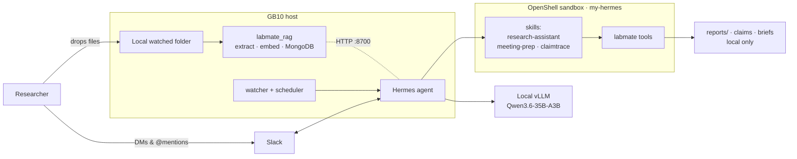

# Labmate

**An always-on, local-first research agent for the Dell Pro Max with GB10.**

Labmate is a private assistant for researchers working with unpublished or
proprietary material. It answers questions about a project's own files, prepares
meeting briefings, and checks the claims in a manuscript against the underlying
data — and it keeps doing that work on its own as the project changes. Every
model call and every research file stays on the box: the product makes **no
cloud LLM calls**.

Built for the Cornell Dell × NVIDIA hackathon. The agent runs as **Hermes**,
sandboxed by **OpenShell** and installed/managed by **NVIDIA NemoClaw**, with
inference served locally by vLLM (Qwen3.6-35B-A3B-NVFP4).

> Naming note: the product is *Labmate*; earlier commits and the Slack
> bot/channel (`@ClaimTrace` / `#claimtrace`) use the original *ClaimTrace*
> name. They refer to the same system.

---

## What it does

| Capability | How it works | Entry point |
|---|---|---|
| **Grounded Q&A** | Answers only from local passages, every statement cited to `path` (page N). Never answers from general knowledge. | `labmate ask` |
| **Meeting prep** | Assembles a one-page briefing from the project's own files — what changed, open questions, likely questions. | `labmate meeting-brief` |
| **Claim checking** | The model picks *what* to check and reads the sources; deterministic pandas does *every* computation. A reported number is compared to a recomputed one and marked supported / conflicting / missing-evidence / unverifiable. | `labmate verify`, `labmate claim-set` |
| **Catch-up digest** | What changed, what's open, what's coming up. | `labmate digest` |
| **Always-on autonomy** | Two lightweight loops act without being asked (below). | `labmate.watcher`, `labmate.scheduler` |

The model never computes a value and never invents a file path. Numbers come
from recorded tool calls a reviewer can re-run; citations resolve to real files.

### Two kinds of always-on work

- **Watcher** (`labmate/watcher.py`) — *reactive.* Polls file hashes; when a
  source file changes, it wakes the agent to re-verify the claims that cite it.
- **Scheduler** (`labmate/scheduler.py`) — *scheduled.* Each tick runs cheap
  deterministic checks to build a **ranked backlog** (imminent meeting without a
  brief, changed evidence, unverified claims, missing-evidence re-searches, a
  periodic digest) and wakes the agent only for the top item once it clears its
  rate limit. A tick with nothing to do logs `quiet` and spends no GPU turn.

Both wake the agent with a one-shot `hermes -z … --yolo` turn — the loops decide
*when* and *which*; the agent decides *how*.

---

## Architecture



Three workstreams, one contract (`CONTRACT.md`):

- **Agent / skills** — `labmate/` (the deterministic tool surface the agent
  calls) and `skills/` (three Hermes skills). The agent talks to people; it
  calls `labmate` for facts.
- **Ingestion / RAG** — `labmate_rag/` turns `projects/<id>/originals/` into a
  manifest, page-marked extracted text, and a searchable index in the box's
  MongoDB (hybrid `$vectorSearch` + full-text `$search`, fused with reciprocal
  rank fusion; `all-MiniLM-L6-v2` on CPU). Runs on the host and is reached from
  the sandbox over a single allow-listed endpoint.
- **Runtime / Slack** — `runtime/` connects the Hermes sandbox to Slack and
  posts sanitized notifications into `#claimtrace`.

They meet at one function — everything (Q&A, briefings, claim evidence) is
backed by it:

```python
import labmate_rag
labmate_rag.retrieve(project_id, query, k=5)  # -> [{path, page, section, text, score}]
```

If it's unavailable, the agent falls back to a local keyword search over
extracted text and reports which backend served the query — so the demo runs
end to end even if MongoDB isn't up.

---

## The privacy boundary

This is the whole point, so it's enforced, not assumed.

| Stays on the box | May leave the box |
|---|---|
| Original documents, extracted text, embeddings | Slack commands and `@mentions` |
| Claim records, evidence, audit reports, briefings | Sanitized notifications: project id, status counts, a local report pointer |
| All model inference (local vLLM) | Files a user chooses to upload *in Slack* (see below) |

- The agent has no `send_message` tool. Every unprompted Slack post is sent
  host-side by the worker via `hermes send` inside the sandbox — so Slack tokens
  live only in OpenShell's credential store and the host never sees them.
- The sandbox is deny-all except the endpoints it needs. Slack file downloads
  are allowed by `policy/slack-files.yaml`; the RAG endpoint by
  `policy/labmate-rag-host.yaml`.
- Projects mount **read-only** at `/sandbox/projects`; the agent writes its state
  elsewhere (`LABMATE_STATE_ROOT`). `display.platforms.slack.tool_progress` is
  turned **off** so the agent's file paths and commands are never echoed into the
  channel.
- A file uploaded *through Slack* has transited Slack's cloud before Labmate
  sees it. `labmate/slack_intake.py` turns such an upload into an ordinary local
  file (download → `originals/` → ingest → the watcher picks it up), but the
  local watched folder remains the path for genuinely confidential material.

---

## Repository layout

```
labmate/            Agent tool surface (the CLI the skills call)
  cli.py            ask · digest · verify · claim-* · meeting-* · report · notify · …
  store.py          project paths, manifest, claim records, audit state, hashing
  verify.py         deterministic pandas primitives + tolerance comparison
  retrieval.py      RAG adapter with local keyword fallback
  meetings.py       local meeting register + briefing assembly
  ingest.py         copy→extract→manifest (shared local ingest)
  slack_intake.py   a Slack upload becomes a local project file
  watcher.py        reactive autonomy (file-change → re-audit)
  scheduler.py      scheduled autonomy (priority backlog)
skills/             Hermes skills: research-assistant, meeting-prep, claimtrace
labmate_rag/        Ingestion / retrieval lane (host: extract, embed, MongoDB, serve)
runtime/            Slack lane: sandbox↔Slack wiring, notification worker, verify scripts
policy/             OpenShell network policies (RAG endpoint, Slack file downloads)
scripts/            deploy-to-sandbox.sh · demo.sh · make-demo-manuscript.py · archive
tests/              smoke.sh (no model needed) · test_rag.py · test_state_root.py
gb10-offline-bundle/  arm64 OpenShell + Node tarballs for an offline GB10 install
CONTRACT.md         the frozen interface between the three lanes
CLAUDE.md           machine/stack context for Claude Code sessions on the box
```

---

## Quickstart (on the GB10)

Assumes NemoClaw + Hermes are installed and vLLM is serving locally
(`curl http://127.0.0.1:8000/v1/models`). See `CLAUDE.md` and
`HACKATHON-CHEATSHEET.md` for install.

```bash
# 1. Deploy the agent tools + skills into the running sandbox
./scripts/deploy-to-sandbox.sh my-hermes

# 2. Bring up the RAG lane on the host (once)
python3 -m venv .venv && . .venv/bin/activate
pip install -r requirements.txt
python3 -m labmate_rag download-model && python3 -m labmate_rag check

# 3. Make a project: drop files in originals/, then extract + embed + index
mkdir -p projects/demo/originals && cp demo-data/*.pdf projects/demo/originals/
python3 -m labmate_rag ingest demo          # add --no-index for the offline path

# 4. Ask the agent (dashboard, Slack, or one-shot)
nemohermes my-hermes dashboard-url
nemohermes my-hermes exec -- hermes -z "What is in project demo?" -s research-assistant --yolo

# 5. Run the always-on loops (two kinds of autonomy)
python3 -m labmate.watcher   --project demo --interval 5     # reactive
python3 -m labmate.scheduler --project demo --interval 60    # scheduled
```

Connecting Slack (tokens, channel, read-only mount, behaviour settings) is
documented in `runtime/README.md`.

---

## Testing

```bash
./tests/smoke.sh            # full agent-layer rehearsal, no model required
python3 -m pytest tests/    # RAG contract + read-only-state-root tests
```

`smoke.sh` exercises the whole agent path end to end without the GB10 or a
model: a claim goes supported → conflicting when its evidence file changes,
affected-claim mapping, meeting briefings, the scheduler's backlog and rate
limits, Slack-intake validation, and that notifications carry no research
content.

---

## Deliverables

- **Repo** — this repository.
- **Pitch deck** — `docs/Labmate_Hackathon_Pitch_Deck.pptx`.
- **Demo** — `scripts/demo.sh` walks the five-minute path.
